# BabyCare Project
<b><u>Objective</b></u> 
A software product which provides solution for baby health, baby food, baby tips, baby products, baby names, parenting etc. Here, user can view baby names, baby tips, baby food and baby product. Admin can add and delete baby names. 

<b>Users of system</b> 
<ul><li>Admin</li><li>Users</li></ul>
<b>Functional Requirements</b> 
<ul><li>Admin</li>
1.	Can login and logout.  
2.	Can add baby names.  
3.	Can view baby names.  
4.	Can delete baby names.  
 
<li>Users</li>
1.	Can view baby names.  
2.	Can view baby tips.  
3.	Can view baby food.  
4.	Can view baby products.  
</ul>
<b>Tools Used</b> 
1.	Eclipse IDE  
2.	MySQL Database   
<b>Working of Project with Screenshots</b> 
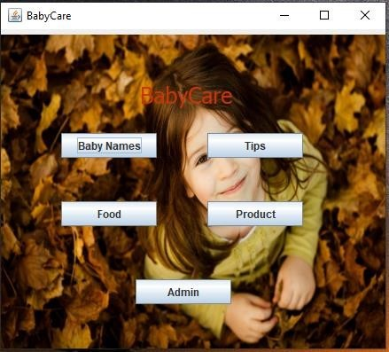 
This is the home page of the application, clicking the buttons will open a new frame and current frame will be disposed.  
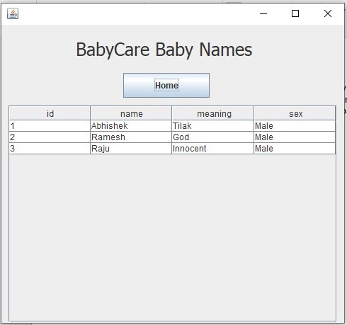 
Baby names list, fetched from database.  
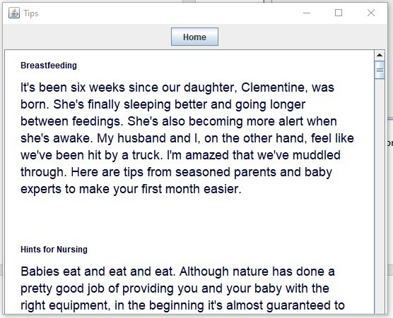 
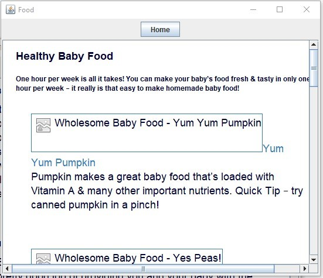 
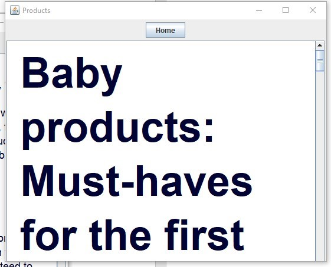 
Tips, Food and Products page.  
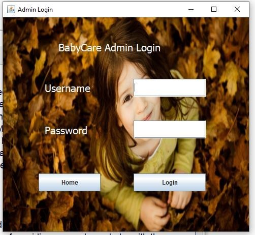 
Clicking on ‘Admin’ button will open this admin login page. 
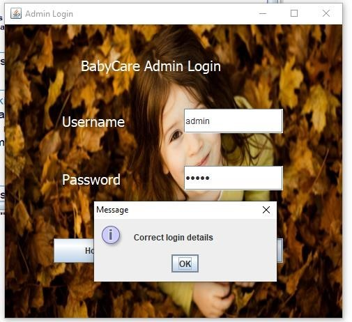 
On entering correct credentials, this message will be displayed.  
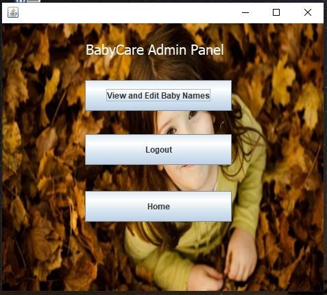 
After logging in, this admin panel will open where the admin can view/edit baby names present in the database.  
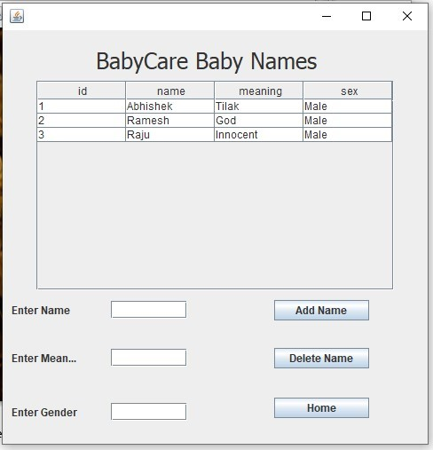 
Admin can add baby names by filling all the fields and then pressing ‘Add Name’ button or can delete name of baby present in database by entering the name of the baby and then pressing ‘Delete Name’  
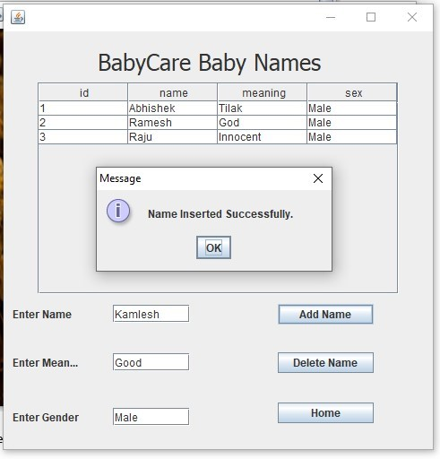 
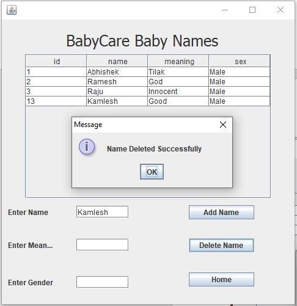 
These messages will be displayed after adding or deleting baby names and the list will be refreshed automatically.  

<b>Class Diagram</b> 
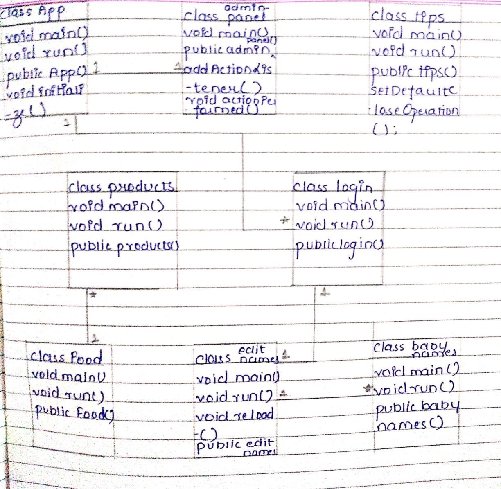 
<b>Activity Diagram</b> 
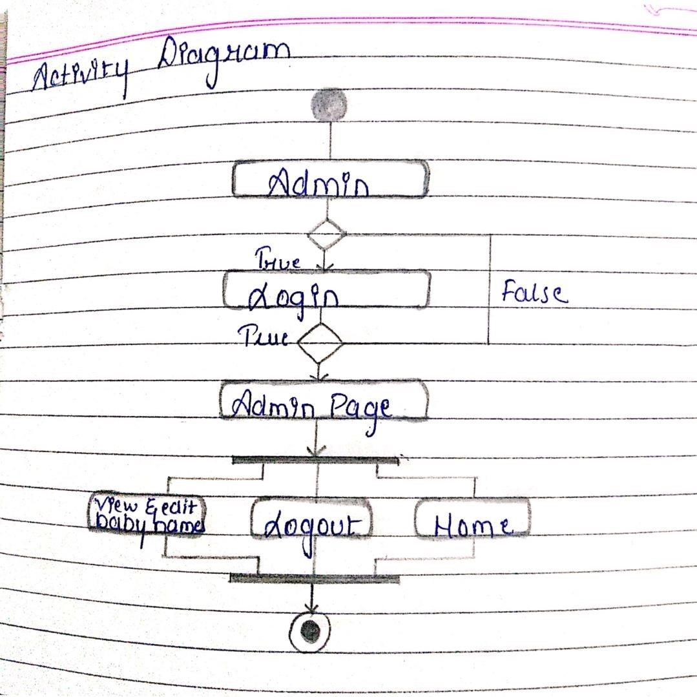 
<b>ER Diagram</b> 
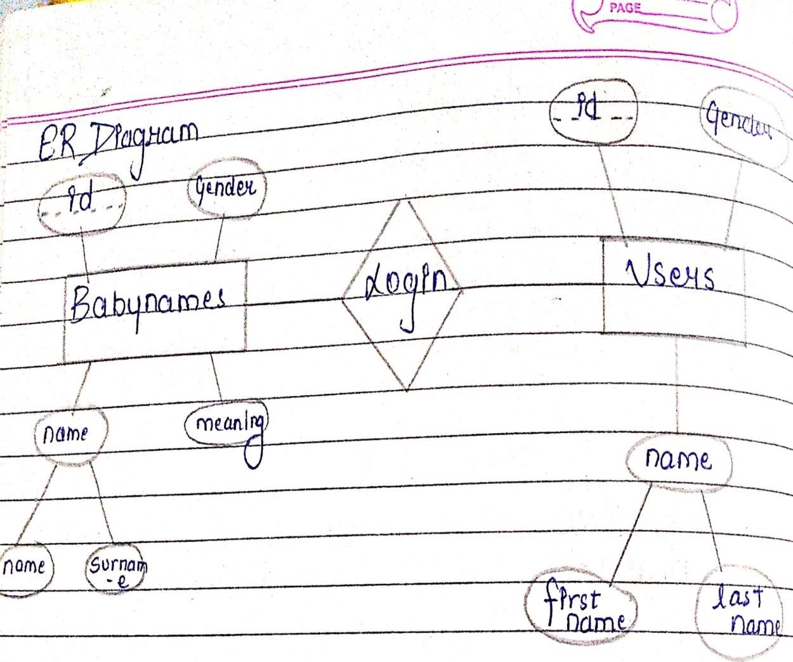 
<b>Flow Diagram</b> 
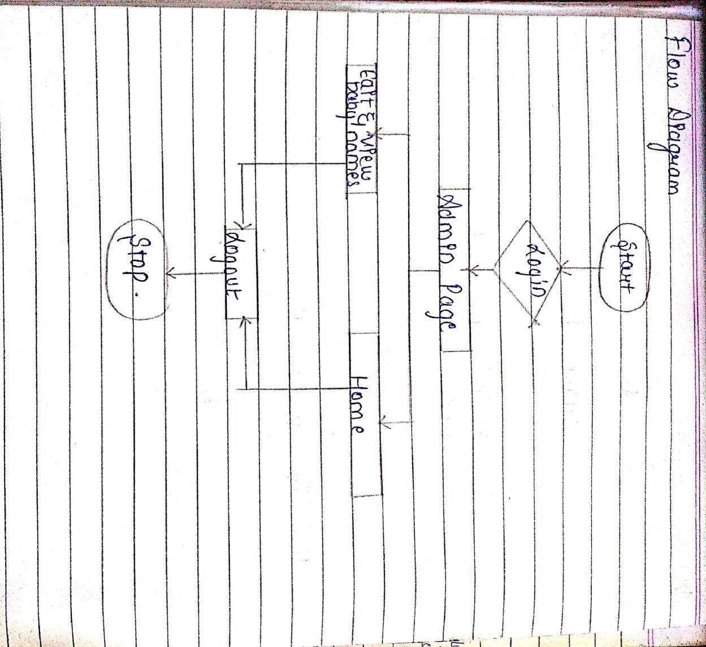 
